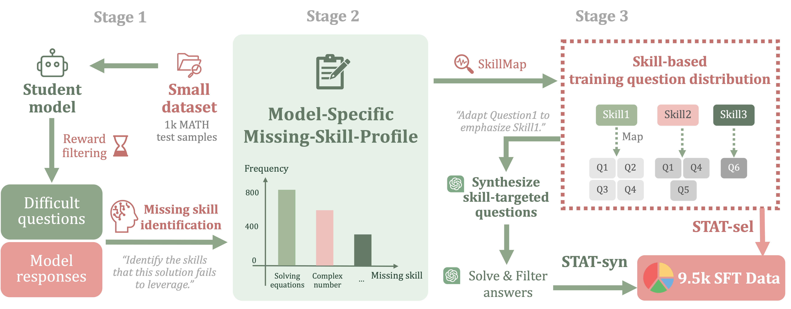

# Skill-Targeted Adaptive Training (STAT)
This is the official repository for the paper [**"Skill-Targeted Adaptive Training"**](https://arxiv.org/abs/2510.10023). 

Authors: [Yinghui He](https://ying-hui-he.github.io/), [Abhishek Panigrahi](https://abhishekpanigrahi1996.github.io/), [Yong Lin](https://linyongver.github.io/Website/), [Sanjeev Arora](https://www.cs.princeton.edu/~arora/).




🚨 We introduce **Skill-Targeted Adaptive Training (STAT)**, which uses a supervisor model and a skill catalog to construct a **Missing-Skill-Profile** for each student model, and then modifies training to squeeze out **>=7%** more performance! The intervention can be as simple as reweighting existing training sets. You can also think of this as a more effective distillation method.


[[Arxiv]](https://arxiv.org/abs/2510.10023) [[Twitter]](https://x.com/yinghui_he_/status/1980257694704619679) [[Connect with authors]](https://x.com/yinghui_he_)


## 💻 Release Checklist
- [x] Part 1: Skill-targeted training data
- [ ] Part 2: Training data creation code
- [ ] Part 3: STAT models


## 🧩 Part 1: Skill-Targeted Training Data
We conducted adaptive training data selection for three models: Llama-3.2-3B-Instruct, Llama-3.2-1B-Instruct, and Qwen2.5-3B. 
The model-specific training data are provided under **`STAT_data/`**. Each dataset contain roughly 4k unique questions, 9.5k QA pairs.

We create two sets of training data (**STAT-Sel** and **STAT-Syn**) for each model using two method variants:
### STAT-Sel: Simply reweighting the hendrycks MATH dataset in favor of missing skills
1. We begin by filtering 500 difficult questions from the validation set using our process reward model. For each such question, the teacher model identifies 2–3 missing skills in the student’s response. 

2. We then create the training set by selecting 5 questions for each missing skill in the question’s **Missing-Skill-Profile**. 

3. We use 3 answers for each question and randomly sample a subset of 9.5k question–answer pairs as our training set.

### STAT-Syn: Synthesizing MATH-level data to emphasize missing skills

1. We begin by filtering 500 difficult questions from the validation set using our process reward model. For each such question, the teacher model identifies 2–3 missing skills in the student’s response.  
2. For each pair of `(difficult_question, missing_skill)`, we retrieve 3 questions from the MATH training set. We input these 3 questions, along with the `missing_skill`, to the teacher model, prompting it to synthesize 2 new questions. The teacher further generates 3 solutions for each new question. 

3. We then filter the newly synthesized data by:


    a. **Compute consistency scores** for each set of `(new_question, solution)` pairs, according to the number of solutions agreeing on the final answer. For example, a new question with 2 solutions agreeing on the final answer has a consistency score of 2.

    b. **Keep only the** `new_question` **with a consistency score of ≥ 2.**

    c. **For each filtered question, keep only the** `solution` **that agrees on the final answer.**

This process enables our approach to generate diverse data, as we input 3 questions to the teacher model as references each time. The consistency-filtering step filters out both invalid questions and solutions, ensuring the quality of **STAT-Syn**.


## Issues & Questions
If you have any questions on the code or the paper, feel free to email Yinghui (yh0068@princeton.edu). If you encounter any problems when using the code, or want to report a bug, please open an issue. We welcome all kinds of constructive discussions!


## Citation
If you find our work useful, please consider citing it! 🤗

```BibTeX
@article{he2025skilltargetedadaptivetraining,
  title={Skill-Targeted Adaptive Training}, 
  author={Yinghui He and Abhishek Panigrahi and Yong Lin and Sanjeev Arora},
  journal={arXiv preprint arXiv:2505.00147},
  year={2025},
  url={https://arxiv.org/abs/2510.10023}, 
}
```